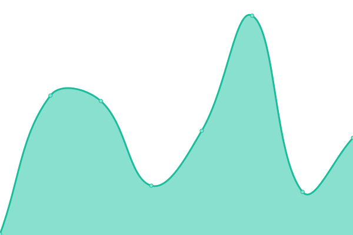

# [📈 Live Status](https://edgus1.github.io/WebStatus): <!--live status--> **🟧 Partial outage**

This repository contains the open-source uptime monitor and status page for [EduardoNav](https://edgus1.github.io/WebStatus), powered by [Upptime](https://github.com/upptime/upptime).

With [Upptime](https://upptime.js.org), you can get your own unlimited and free uptime monitor and status page, powered entirely by a GitHub repository. We use [Issues](https://github.com/edgus1/WebStatus/issues) as incident reports, [Actions](https://github.com/edgus1/WebStatus/actions) as uptime monitors, and [Pages](https://edgus1.github.io/WebStatus) for the status page.

<!--start: status pages-->
<!-- This summary is generated by Upptime (https://github.com/upptime/upptime) -->
<!-- Do not edit this manually, your changes will be overwritten -->
<!-- prettier-ignore -->
| URL | Status | History | Response Time | Uptime |
| --- | ------ | ------- | ------------- | ------ |
|  [priceviz](https://priceviz.onrender.com) | 🟥 Down | [priceviz.yml](https://github.com/EDGUS1/WebStatus/commits/HEAD/history/priceviz.yml) | 

 2104ms
     
 | 

<a href="https://edgus1.github.io/WebStatus/history/priceviz">88.62%</a>
    

|  [SOE](https://soe-iw6w.onrender.com/) | 🟥 Down | [soe.yml](https://github.com/EDGUS1/WebStatus/commits/HEAD/history/soe.yml) | 

 198ms
     
 | 

<a href="https://edgus1.github.io/WebStatus/history/soe">0.00%</a>
    

|  [Scrattech](https://twitterscrapper-production.up.railway.app/) | 🟥 Down | [scrattech.yml](https://github.com/EDGUS1/WebStatus/commits/HEAD/history/scrattech.yml) | 

 434ms
     
 | 

<a href="https://edgus1.github.io/WebStatus/history/scrattech">0.00%</a>
    

|  [SilaboAngular](https://silaboangular.netlify.app) | 🟩 Up | [silabo-angular.yml](https://github.com/EDGUS1/WebStatus/commits/HEAD/history/silabo-angular.yml) | 

 154ms
     
 | 

<a href="https://edgus1.github.io/WebStatus/history/silabo-angular">100.00%</a>
    

|  [reask](https://reask.netlify.app) | 🟩 Up | [reask.yml](https://github.com/EDGUS1/WebStatus/commits/HEAD/history/reask.yml) | 

 177ms
     
 | 

<a href="https://edgus1.github.io/WebStatus/history/reask">100.00%</a>
    

|  [SilaboSvelte](https://silabosvelte.netlify.app) | 🟩 Up | [silabo-svelte.yml](https://github.com/EDGUS1/WebStatus/commits/HEAD/history/silabo-svelte.yml) | 

 328ms
     
 | 

<a href="https://edgus1.github.io/WebStatus/history/silabo-svelte">100.00%</a>
    

|  [SistemaVacunacion](https://sistema-vacunacion.onrender.com/) | 🟥 Down | [sistema-vacunacion.yml](https://github.com/EDGUS1/WebStatus/commits/HEAD/history/sistema-vacunacion.yml) | 

 3022ms
     
 | 

<a href="https://edgus1.github.io/WebStatus/history/sistema-vacunacion">94.58%</a>
    

|  [GaleriaWc](https://edgus1.github.io/galeria-wc/) | 🟩 Up | [galeria-wc.yml](https://github.com/EDGUS1/WebStatus/commits/HEAD/history/galeria-wc.yml) | 

 106ms
     
 | 

<a href="https://edgus1.github.io/WebStatus/history/galeria-wc">100.00%</a>
    

|  [ShareDataApp](https://share-data-app-production.up.railway.app/) | 🟥 Down | [share-data-app.yml](https://github.com/EDGUS1/WebStatus/commits/HEAD/history/share-data-app.yml) | 

 262ms
     
 | 

<a href="https://edgus1.github.io/WebStatus/history/share-data-app">0.00%</a>
    

<!--end: status pages-->

[**Visit our status website →**](https://edgus1.github.io/WebStatus)

## 📄 License

- Powered by: [Upptime](https://github.com/upptime/upptime)
- Code: [MIT](./LICENSE) © [EduardoNav](https://edgus1.github.io/WebStatus)
- Data in the `./history` directory: [Open Database License](https://opendatacommons.org/licenses/odbl/1-0/)
